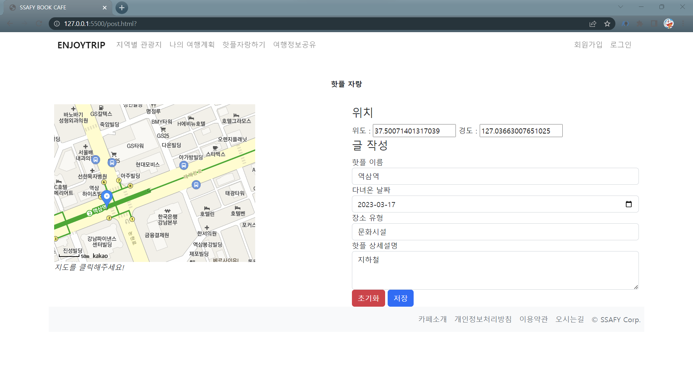
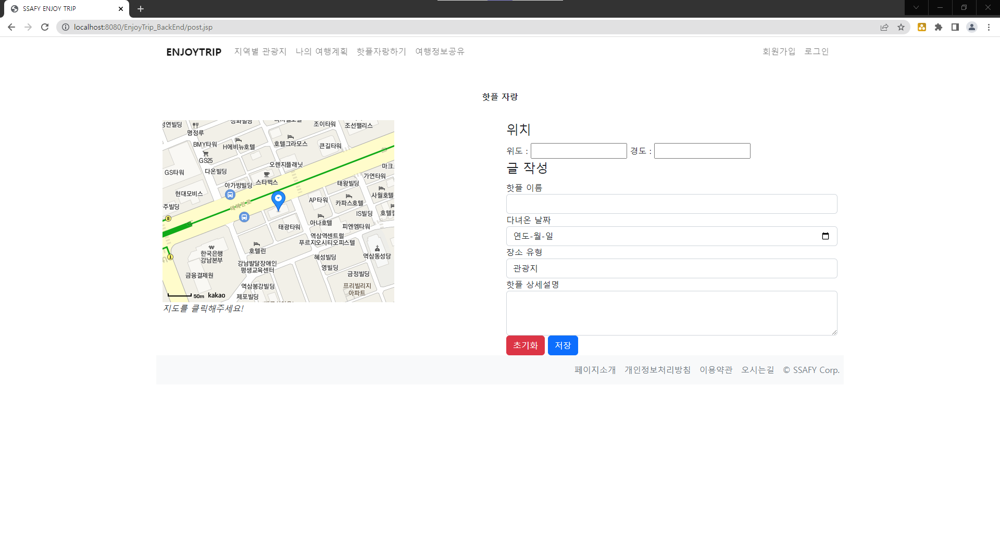
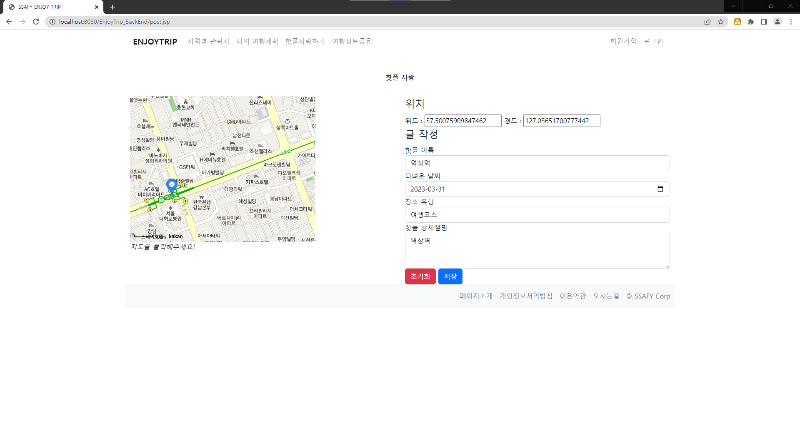
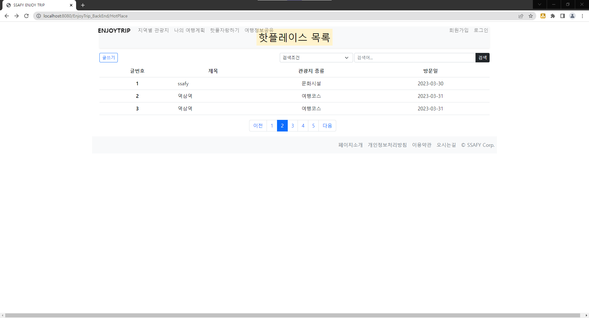

## 설명
Servlet과 템플릿 엔진인 JSP를 이용하여, 여행 관련 게시판 구축.
## 기술 스택
HTML ,CSS, Javascript, Java,  Servlet, JSP, MySQL

## 처리된 요구사항 목록
  
|난이도|구현기능|세부|작성여부(O/X)|
|:---:|---|---|:---:|
|기본|메인페이지 및 메뉴 구성||O|
|기본|관광지 정보 조회||O|
|기본|회원관리페이지|회원 등록 화면|O|
|기본|회원관리페이지|회원 수정 화면|O|
|기본|회원관리페이지|회원 삭제 화면|O|
|기본|회원관리페이지|회원 조회 화면|O|
|기본|로그인/로그아웃 페이지||O|
|추가|사이트맵/전체적인 메뉴 구성 화면||O|
|추가|나만의 여행 계획 페이지||O|
|심화|HotPlace 관련 페이지||O|
|심화|게시판 페이지|글등록, 목록|O|
|심화|게시판 페이지|조회, 수정화면|X|

## 실행화면 캡쳐 

### 구현 기능 : 전체화면 

### 구현 기능: 나의 여행 계획 세우기

### 구현 기능: 로그인 및 회원가입

### 구현 기능: 관광지 정보 조회

### 구현 기능: HotPlace, 게시판 관련 페이지

